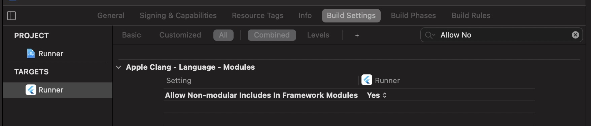

# flutter_ddshare

钉钉 Flutter 插件,支持IOS,Android 端授权

## 配置
### ios端
1. Build Settings 中设置Allow Non-modular Includes In Framework Modules 为YES



2. 在Other Linker Flags添加 `-all_load` 选项；


3. 将申请的appId添加到URL Types中作为钉钉回调的scheme, identifier 填写dingtalk; URL Schemes填写申请的AppId。 iOS9及以后的系统需要将钉钉和分享SDK的scheme配置在Info.plist。LSApplicationQueriesSchemes列表中，scheme分别为 dingtalk, dingtalk-open


### Android端
暂不需要配置

### 参考钉钉官方文档
[钉钉官方文档](https://ding-doc.dingtalk.com/doc#/native/oguxo2)

## 使用
```dart
//注册钉钉插件
FlutterDdshare.registerApp('Your AppId', 'Your IOS BundleId')

//钉钉是否安装
FlutterDdshare.isDDAppInstalled()

//钉钉授权
FlutterDdshare.sendDDAppAuth('state');

//分享文本
FlutterDdshare.sendTextMessage('分享文本');

//分享图片
FlutterDdshare.sendImageMessage(picUrl:'https://www.baidu.com/img/PCtm_d9c8750bed0b3c7d089fa7d55720d6cf.png');

//分享链接
FlutterDdshare.sendWebPageMessage('https://www.baidu.com/',title: '标题',content: '描述2333',
                                  thumbUrl:'https://www.baidu.com/img/PCtm_d9c8750bed0b3c7d089fa7d55720d6cf.png');

// 回调
FlutterDdshare.ddResponseEventHandler.listen((resp) async {
  //授权回调信息
  if (resp is DDShareAuthResponse) {
    print('授权回调信息=====> code: ${resp.code}  state:${resp.state}');
  }
});

```